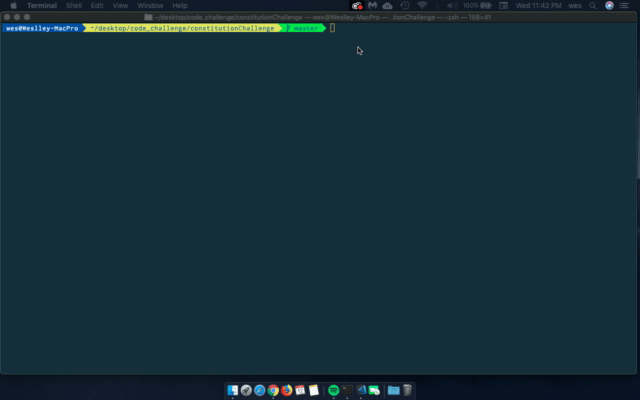

# constitutionChallenge

Code challenge for counting words starting and ending with certain letters from the preamble to the united states constitution.

"We the People of the United States, in Order to form a more perfect Union, establish Justice, insure domestic Tranquility, provide for the common defence, promote the general Welfare, and secure the Blessings of Liberty to ourselves and our Posterity, do ordain and establish this Constitution for the United States of America."

# Run the code

Open your CLI and simply run `node index.js`
By default it will use the first letter as (t) and last letter as (e), but you can also pass different ones like this for example `node index.js p a`

# Preview

